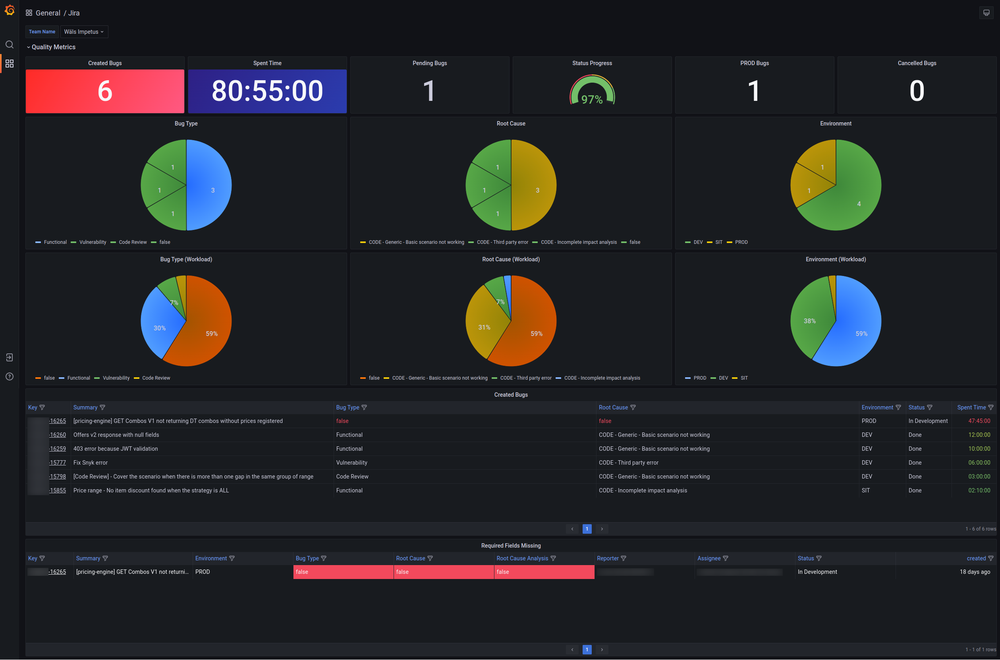
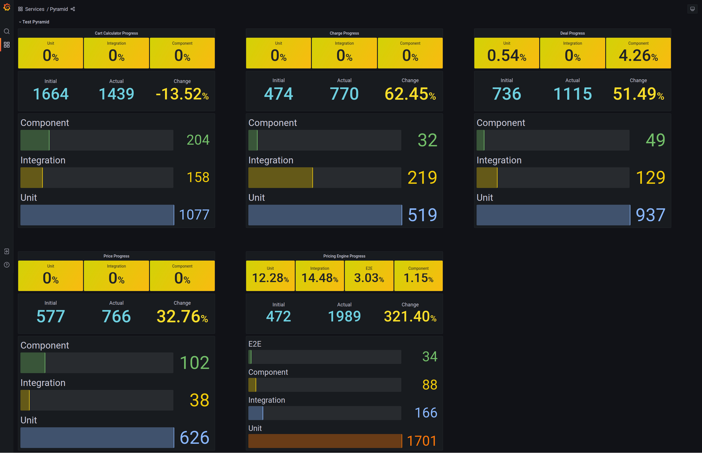
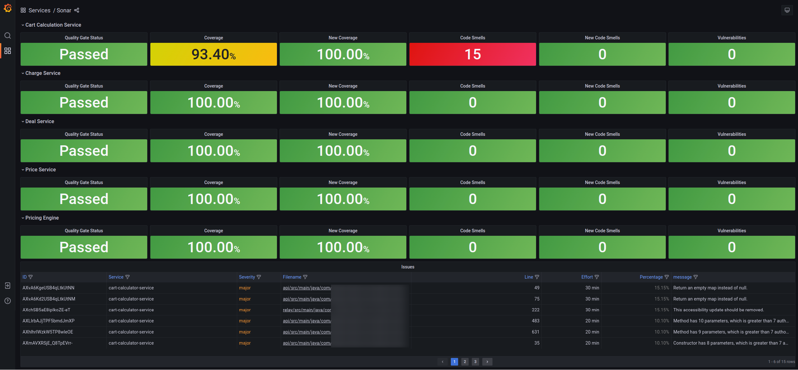

# QA Metrics

This is a dashboard where Jira, Sonar and Test Pyramid are all-in-one place for QA Metrics.

  

  

  

## STACK

- Docker
- Grafana
- InfluxDB
- Newman

## SETUP

Please, follow the next steps in order to run this project on your local machine.

### Requirements

First of all, install the following:

- [Docker](https://www.docker.com/get-started/)
- [Docker Compose](https://docs.docker.com/compose/install)

#### Generate API Tokens

Use the following to fill in the file [newman/qametrics.postman_environment.json](newman/qametrics.postman_environment.json) environment fields.
By the way, you can import this file to your Postman application and update from there, then you can export and save it to the project in the `newman` folder.

[SonarCloud](README_SONAR.md)

[Jira (Atlasian)](README_JIRA.md)

[Test Pyramid](README_PYRAMID.md)

## RUN METRICS

### Start

To run this project, simply open a console and type in the following command, After that, visit [localhost:3000](http://localhost:3000)

```shell
docker-compose up
```

You do not need a [login](http://localhost:3000/login) to see the dashboard, only if you need to change the queries, etc. For that, the user and password are `pricing`. Enjoy!

### Stop

And to end the composed project, just run:

```shell
docker-compose down
```

### Restart Newman

If you need to rerun the newman service in order to update the metrics, just restart newman:

```shell
docker-compose restart newman
```

## JIRA_FILTER environment variable

For each sprint, please update the created date range in the `JIRA_FILTER` environment variable.

DO NOT FORGET TO ESCAPE STRINGS ([onlinestringtools.com/escape-string](https://onlinestringtools.com/escape-string))

```string
issuetype in (Bug, Sub-Bug) AND \"Team Name[Dropdown]\" in (\"Wäls Petroleum\", \"Wäls Impetus\", \"Wäls Dubbel\", \"Wäls Trippel\") AND (createdDate >= 2022-03-01 AND createdDate <= \"2022-05-12 23:59\")"
```

## Author

> Lucas Ferreira [@lflucasferreira](https://www.github.com/lflucasferreira)
