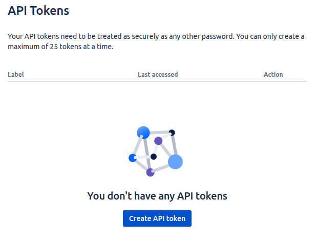
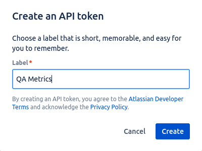
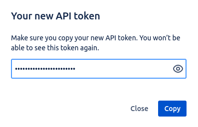

# Jira (Atlassian)

1. Go to [id.atlassian.com/manage-profile/security/api-tokens](https://id.atlassian.com/manage-profile/security/api-tokens);
2. Click in the `Create API Token` button;

    

3. Then, generate a token by entering a token name and clicking in the `Create` button;

    

4. Finally, copy the token and paste it in the `JIRA_API_TOKEN` environment field.

    

    ```json
    {
      "key": "JIRA_API_TOKEN",
      "value": "Paste your Jira api token here",
      "type": "secret",
      "enabled": true
    }
    ```

5. You just need now to fill in the `JIRA_USER` environment with your email address.

    ```json
    {
      "key": "JIRA_USER",
      "value": "Paste your Jira email address here",
      "type": "default",
      "enabled": true
    }
    ```

6. Update the `JIRA_ORGANIZATION` environment variable with the organization name (find it in the main Jira URL);
7. Update the `JIRA_BASE_URL` environment variable with the main URL, for example: [https://{organization_name}.atlassian.net](https://{organization_name}.atlassian.net).
