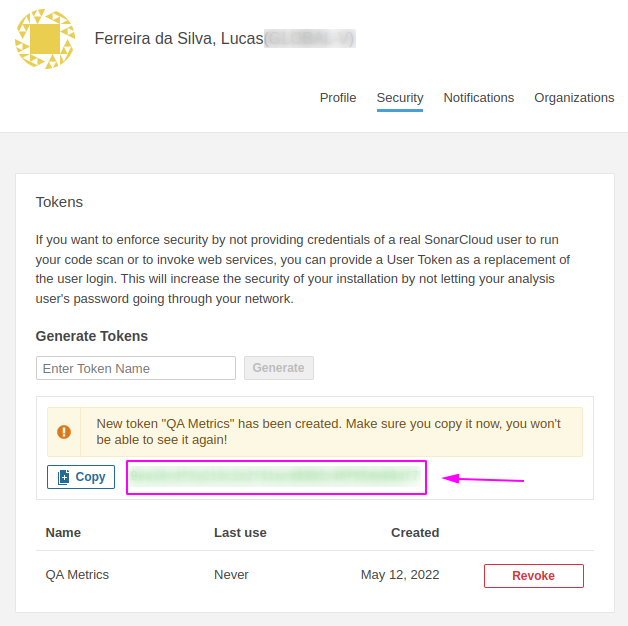

# Sonarcloud

1. Go to [sonarcloud.io/account](https://sonarcloud.io/account);
2. Switch to the `Security` tab;
3. Then, generate a token by entering a token name and clicking in the `Generate` button;
4. Finally, copy the token and paste it in the `SONAR_API_KEY` environment field.

    

    ```json
    {
      "key": "SONAR_API_KEY",
      "value": "Paste your Sonar api key here",
      "type": "secret",
      "enabled": true
    }
    ```
